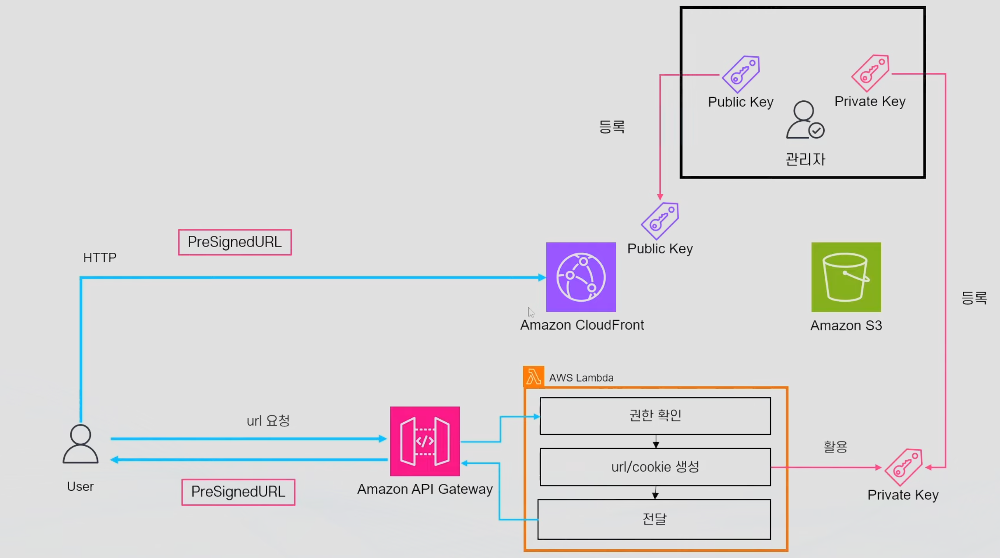
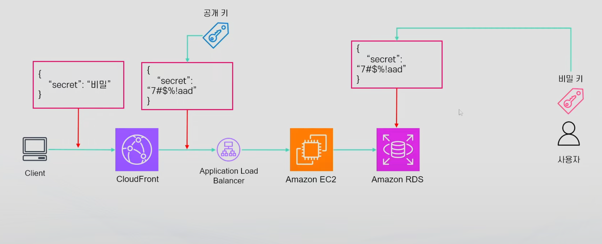

## 컨텐츠 접근 제한
- CloudFront에 접근하는 주체 별로 다르게 컨텐츠의 접근 제한이 필요한 경우
  - 예: 프리미엄 티어용 영상, 유저 전용 다운로드 이미지 등

### 컨텐츠 제한 두가지 방법
- Signed URL: 권한 정보가 담긴 임시 URL을 발급하여 뷰어에게 전달하여 컨텐츠를 다운로드할 수 있도록 허용
  - URL 당 하나의 파일만 사용 가능
- Signed Cookie: 뷰어가 권한을 행사해 다운로드 할 수 있도록 컨텐츠 접근 제한을 가진 Cookie를 발급해 뷰어에 전달
  - Cookie만 있으면 다수의 파일에 사용 가능
- 만료 기간 설정 가능  


### Signer
- Signed URL/Cookie를 만들 권한을 가진 주체
- 두가지 종류
  - Trusted Key Group(추천): CloudFront에 Public/Private Key Pair 중 Public Key를 등록하고 가지고 있는 Private Key로 Presigned URL/Cookie를 생성하는 방식
  - AWS Account(비추천): Root 사용자로 계정의 CloudFront Key Pair를 다운받아 활용
    - 비추천: AWS Root 사용자를 활용해야 하고, API를 사용할 수 없고, IAM을 통한 권한 제어 불가능
- CloudFront URL을 만들 때 Distribution 단위로 등록된 Key Group을 활용
  - Key Group: Private/Public Key로 이루어진 키쌍의 집합으로 CloudFront에 업로드하는 하나 이상의 Public Key로 구성

### Presigned 정책
- Presigned URL/Cookie 만들 때 URL/Cookie의 권한을 설정하기 위한 정책
- 두가지 종류
  - Canned(미리 준비된) Policy: 간단한 버전, 만료시간만 설정 가능. URL이 짧은 장점
  - Custom Policy: 모든 제약사항 설정 가능
- 각 정책으로 Presigned URL/Cookie의 동작 범위(만료 시간, IP 제한 등) 설정 가능   

    ||Canned Policy|Custom Policy|
    |:--:|:--:|:--:|
    |정책 재사용|No|Yes|
    |사용 가능 시점 적용| No | Yes(optional)|
    |만료 시점 적용| Yes | Yes |
    |IP Range 제한| No | Yes(optional) | 


### Presigned URL 만들기 실습(이건 나중에 다시..)
1. Public/Private KeyPair 생성
```sh
openssl genrsa -out private_key.pem 2048
openssl rsa -pubout -in private_key.pem -out public_key.pem
```
2. CloudFront에 Public Key 등록 후 Keygroup 생성
3. presignedURL 사용하도록 설정하면 배포 후 endpoint가 하나 생성되고 이 endpoint를 통해 URL을 생성할 수 있다.
4. parameter Store에 가보면 presignedURL 관련 파라미터가 생성되어 있고 여기에 private Key를 입력해 두자.

## CloudFront Origin에 대한 직접 접근 제한
- CloudFront를 거치지 않은 Origin에 대한 접근을 막고 싶은 경우
### Origin Access Control(OAC)
- OAI와 함께 CloudFront를 거치지 않은 S3에 접근을 방지하기 위한 기능
  - Origin Access Identity(OAI): 예전 방식, OAC 권장
- OAC는 일종의 Identity: IAM 사용자 혹은 IAM 역할과 비슷한 Identity
  - 즉 S3에서 해당 OAC의 접근을 허용하고 CloudFront에서 OAC를 활용해서 S3와 소통
- OAC는 Lambda Function URL에도 사용 가능

### S3와 소통 위한 Origin Access Control(OAC)의 세가지 Sign 방법
- CloudFront가 S3와 소통하기 위한 요청에 Sign 방법을 정의 가능
- 3가지 종류
  - Sign Requests: CloudFront IAM Principle이 S3에 요청할 때 SigV4로 Sign
    - 즉 요청에 자격증명을 활용해 필요한 정보로-> Authorization Header를 구성->S3에서 해당 내용을 검증해서 자격이 있는 요청인지 확인 -> 요청 처리 or 거부
    - 클라이언트가 Sign한 헤더가 있다면 덮어씌움
  - Do not override authorization header: 클라이언트 Header가 있다면 사용, 없으면 새로 Sign
  - Do not sign requests: Authorization Header를 사용하지 않음
    - 클라이언트가 항상 Sign을 통해 요청하거나 컨텐츠가 퍼블릭인 경우
### Custom Origin 보호
- Customer Header 활용
  - 방법1. CloudFront에서 Header 생성 -> Origin에 해당 Header가 없으면 거부
  - 방법2. Origin에서 CloudFront IP를 제외한 모든 트래픽을 차단
    - AWS 관리형 접두사 목록을 사용하여 보안그룹 생성. AWS 관리형 접두사 목록에는 AWS가 관리하는 IP목록이 포함되어 있다.

### 뷰어 액세스 제한
- CloudFront에 허용된 방법으로만 접근 가능하도록 설정하는 방법
- 이전 설명한 서명된 URL,Cookie통한 접근 제어

### 지리적 배포 제한(Geo Restriction)
- CloudFront 지리 배포 제한
  - Whitelist 혹은 Blacklist -> 나라별 기준
  - 모든 배포에 제한 사항 포함
    - 즉 일부만 제한 걸기 불가능
  - IP주소의 정확도는 99.8%
- 3rd party 지리적 위치 서비스 사용

### Field-Level Encryption
- CloudFront를 활용하여 실제 데이터를 처리하는 주체까지 데이터를 암호화해서 전달할 수 있는 방법
  - HTTPS 통신과는 별도의 개념
- Edge Location에서 받은 데이터 중 특정 데이터를 주어진 퍼블릭 Key로 암호화
- 이후 데이터를 처리하는 측에서 프라이빗 Key로 복호화하여 사용  




