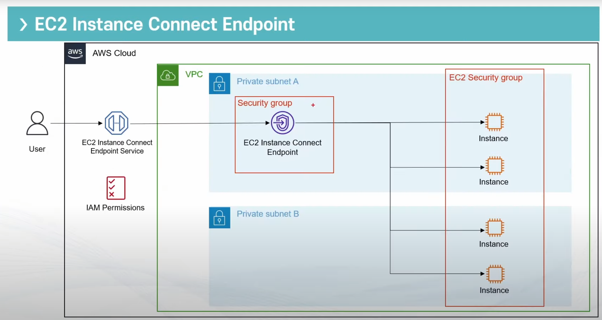

## EC2 예약 인스턴스
일정기간 약정하여 요금을 할인받는 방식(최대 72%)
- 온디맨드 EC2 사용 요금을 할인 받은 요금으로 대체 적용
- 할인받고 싶은 EC2 인스턴스와 같은 리전, 유형 구매 필요
- 약정 기간이 길수록 더 큰 할인률
- 리전별로 적용
- 한달에 구매 가능한 총 개수 제한
  - 리전 예약 인스턴스: 20개
  - 영역(AZ) 예약 인스턴스: 영역 당 20개
  - 예: 가용영역이 4개인 리전이라면, 리전20+4x20=총100개 구매 가능
- 구매 대기 신청 지원: 리전 예약 인스턴스만 가능
- 다른 계정과 RI(Reserved Instance) 공유 가능(AWS Organization)

### 선택 구성 요소
- 인스턴스 유형
- 테넌시
  - 전용 호스트 혹은 공유 하드웨어(일반적)
  - 전용 호스트는 라이센스 등의 문제로 물리적으로 떨어진 가상 서버가 아닌 물리적인 서버를 대여하는 것, 비쌈
- 플랫폼: Window or Linux
- 기간약정: 1년(최대 40% 할인) or 3년(최대 72% 할인)
- 결제 방법
  - 전체 선결제: 모든 금액을 기간 시작 전에 결제 -> 가장 저렴
  - 부분 선결제: 비용 중 일부만 시작 전에 결제 -> 나머지 비용은 할인 가격으로 시간당 청구
  - 선결제 없음: 모든 비용을 할인가격으로 시간당 청구(할부 느낌..)
- 제공 클래스
  - 표준: 큰 할인 혜택, 단 교환 불가능(수정만 가능)
  - 컨버터블: 낮은 할인 혜택. 다른 속성의 예약인스턴스로 교환 가능

### EC2 예약 인스턴스 종류
- 범위에 따라
  - 리전 전체에 사용할 수 있는 예약 인스턴스
    - 미리 용량 예약 불가능.
      -  리전 내 장애복구 등을 위해 특정 용량 타입의 인스턴스가 필요한 경우가 있는데 이 때 용량 타입에 대한 예약을 걸수가 있음. 근데 이게 불가능하다는 의미.
    - 인스턴스 크기 유연성 적용: 크기에 상관없이 인스턴스 패밀리의 사용량으로 예약인스턴스 소모
    - 구매 대기 가능
  - 특정 가용영역에서만 사용할 수 있는 예약 인스턴스
    - 미리 용량 예약 가능 = 따로 해당 유형의 인스턴스를 확보
    - 구매 대기 불가능

    ||리전 예약 인스턴스|영역 예약 인스턴스|
    |--|:--:|:--:|
    |용량예약|X|O|
    |가용영역|모든 영역에서 사용가능|지정된 영역에서만 가능|
    |인스턴스 크기 유연성|O|X|
    |구매 대기열|가능|불가능|
- 제공 클래스에 따라
  - 표준(Standard):
    - 교환 불가능
    - 예약 인스턴스 마켓플레이스에 판매/구매 가능
  - 전환형(Convertible)
    - 인스턴스 유형,플랫폼,범위 또는 테넌시 등의 다른 속성의 전황형 예약 인스턴스와 교환 가능
    - 예약 인스턴스 마켓플레이스에 판매/구매 불가능

### EC2 예약 인스턴스 적용 방식
- 구매 즉시 할인 가격 적용
- 정확하게 설정한 속성과 맞아야 함
  - 인스턴스 유형, 플랫폼,가용역역, 인스턴스 사이즈 등
- 인스턴스 사이즈 유연성(리전 예약 인스턴스 Only)
  - 각 인스턴스 사이즈별로 사용 점수를 보유
  - 구매한 RI의 점수로 사용중인 인스턴스 점수(Normalization Factor)를 커버, 남는 부분은 온디맨드로 과금  
    각 instance 사이즈마다 Normailization Factor가 매겨져 있다. 이에 따라 유연하게 사이즈를 선택해 사용가능.  작은 인스턴스에서 큰 인스턴스로 커버 가능
  - 특정 OS의 경우 적용 불가능
    - Windows Server(SQL 서버), RHEL, SUSE Linux Enterprise Server 등
  - 예시
    -  m5.large는 4점, m5.small은 1점. m5.large를 구매했다면 m5.small을 4개 쓰거나 m5.large 1개를 쓰도록 선택 가능
    -  t2.medium 구매(2점). 2개의 t2.small(1점) or 4개의 t2.micro(0.5점) or 절반의 t2.large(4점)으로 커버

### EC2 예약 인스턴스 비용
- 매시 정각에 비용 발생(선결제 없을 경우)
- 오픈 소스 리눅스(Amazon Linux 등)의 경우 할인 혜택이 초단위로 적용됨
- 상용 리눅스(RedHat 등)의 경우 할인 혜택이 시간 단위로 적용
- 한 RI당 시간당 한 시간의 인스턴스만 커버
  - 예를 들면 m5.large RI를 구매하고 m5.large를 4개를 동시에 동작시키면 나머지 3개에 대해서는 onDemand가 적용된다.  
    만약 m5.large 4개의 동작시간이 합쳐 80분이라면 20분에 대해서만 onDemand 요금이 적용된다.
- $500,000 이상 사용할 경우 RI 할인 혜택

### EC2 인스턴스 수정/교환/판매
- 교환
  - 전환형 RI의 경우 교환 가능
  - 규칙에 맞는 교환이라면 횟수 제한 없음
  - 조건: 내가 보유한 RI 가치 <= 받으려는 가치
  - 현재 AWS에서 제공하는 RI 타입으로만 교환 가능
  - 다른 리전이랑 교환 불가능
  - 예약 인스턴스 한개씩만 교환 가능(받을 땐 여러 인스턴스로 받을 수 있다)
  - 일부만 교환하고 싶을 때는 예약 인스턴스를 작은 단위로 나눈 후 각각의 단위를 교환
  - 전체 선결제와 부분 선결제는 교환 가능
  - 약정 기간이 같은 RI만 교환 가능(1년,3년)
- 수정
  - 가용영역, 인스턴스 사이즈(같은 유형), 범위 변경 가능
  - 분할 가능
    - 1 x t2.small = 2 x t2.micro
    - 10개 AZ a  RI => 5대 AZ a, 5개 AZ b
- 병합 가능
  - 2 x t2.micro => 1 x t2.small
- 인스턴스 사이즈 변경은 리눅스/유닉스만 가능
- 몇가지 인스턴스 유형은 불가능(G4)

### 예약 인스턴스 구매/판매
- AWS 마켓플레이스에서 다른 사람이 판매하는 RI 구매 가능
- 판매 선결제 금액의 12%를 AWS에서 수수료로 가져감
- 미국은행에 계좌가 있어야 판매 가능

## T타입 인스턴스 사용법
- T타입 인스턴스는 burstable performance 인스턴스로 vCPU 사용 시 vCPU 크레딧을 소모함.
- vCPU 크레딧 하나당 vCPU를 1분 동안 100% 사용할 수 있음. 일정 수준의 vCPU사용하면 크레딧을 소모하고 사용량이 적어지면 크레딧이 다시 찬다.  
  vCPU를 많이 사용하여 크레딧이 없으면 CPU 사용량이 줄어들어 먹통이 될 수 있음.
- Baseline: 정해진 CPU 사용량 목표 수준. Size가 커질수록 더 높게 설정 됨. 이 Baseline값보다 vCPU 사용량이 높아지면 Credit이 소모 되고, 낮으면 Credit이 회복 됨
- 시간당 크레딧: vCPU개수 x BaseLine x 60
  - 예를 들면 t3.nano는 vCPU 2개, baseline이 5%이므로 2 X 5% X 60 = 6크레딧(시간당) 회복됨.
- 일반 모드와 무제한 모드가 있음
  - 일반 모드: 크레딧 없으면 베이스 라인 이상으로 CPU를 사용할 수 없음
  - 무제한 모드: 크레딧이 없으면 AWS에서 대출을 해주고 이는 24시간 안에 갚아야 함. 추가 비용이 발생할 수 있으나 먹통이 될일은 없음
  - t2는 기본이 일반 모드, t3는 무제한 모드

## EC2 인스턴스 타입 정리
|범용|컴퓨팅 최적화|메모리 최적화|저장 최적화|
|--|--|--|--|
|t,m,a1,Mac|C,F,Inf,G|r,x,p,z,u-6tb|h,i,d|

### 범용
|t|m|a1|Mac|
|--|--|--|--|
|저렴한 범용  웹서버,DB|범용 어플리케이션서버|ARM기반 에코시스템 워크로드/웹서버 등|맥 기반|

### 컴퓨팅 최적화
|c|f|Ingf|g|
|--|--|--|--|
|컴퓨팅 최적화  CPU 성능이 중요한 앱/DB|하드웨어 가속 유전 연구,금융분석, 빅데이터 분석|머신러닝|그래픽 최적화 3D 모델링/인코딩|

### 메모리 최적화
|r|x|p|z|u-6tb1|
|--|--|--|--|--|
|메모리최적화 메모리 성능이 중요한 앱/DB|메모리 최적화 Spark|그래픽 최적화 머신러닝,비트코인|고주파 수 컴퓨팅 워크로드 EDA앱|대용량메모리인스턴스 가상화 오버헤드를 줄여주는 베어메탈|

### 저장 최적화
|h|i|d|
|--|--|--|
|디스크쓰루풋 최적화 하둡/맵리뷰스|디스크 속도 최적화 NoSQL/데이터 웨어 하우스|디스크 최적화 파일서버/데이터웨어하우스/하둡|

## EC2 Instance Connect EndPoint
-  public IP가 없는(Private Subnet에 위치한) EC2 인스턴스에 SSH 혹은 RDP에 접속할 수 있는 서비스
- 연결 과정
  - EC2 Instance Connect Endpoint를 특정 Subnet에 프로비전
  - 해당 EndPoint를 활요앻 해당 서브넷과 연동된 VPC안의 모든 Subent에 접속
  - EndPoint와 EC2 모두 적절한 보안그룹 설정 필요
- 접속 권한 관리는 IAM으로 관리(ec2-instance-connect:OpenTunnel)
  - maxTunnelDuration: 최대 허용할 터널의 지속시간(Default: 3600초)
- 계정당 최대 5개, VPC당 한개, Subnet당 한개 = 고가용성 고민 필요
- 무료!!

### preserveClientIP
- preserveClientIP= true일 경우 연결시 EC2가 접속하는 Client의 IP주소로 시작된 연결로 인식
  - 사용 조건
    - EC2 인스턴스는 같은 VPC안에 존재해야 함.
    - Transit Gateway 미지원.
    - 특정 인스턴스 타입은 미지원(C1, CC1,CC2, CG1, CG2, CR1, G1, G2, HI1, M1, T1,..)
### 로깅
- CloudTrail을 활용해 터널을 만든 유저와 시간 등 감사 가능

### EC2 Instance Connect Endpoint vs SSM Session Manager
||EC2 Instance Connect Endpoint|SSM Session Manager|
|--|--|--|
|구현|EIC endpoint 생성|SSM 세션매너저를 위한 엔드포인트 생성(3개)|
|로그|CloudTrail Only| CloudTrail/ConnectWatch|
|보안제어|IAM/Security Group|IAM|
|비용|무료|Endpoint 비용 발생(x3)|
|기타|고가용성 고민 필요|고가용성 내제|
