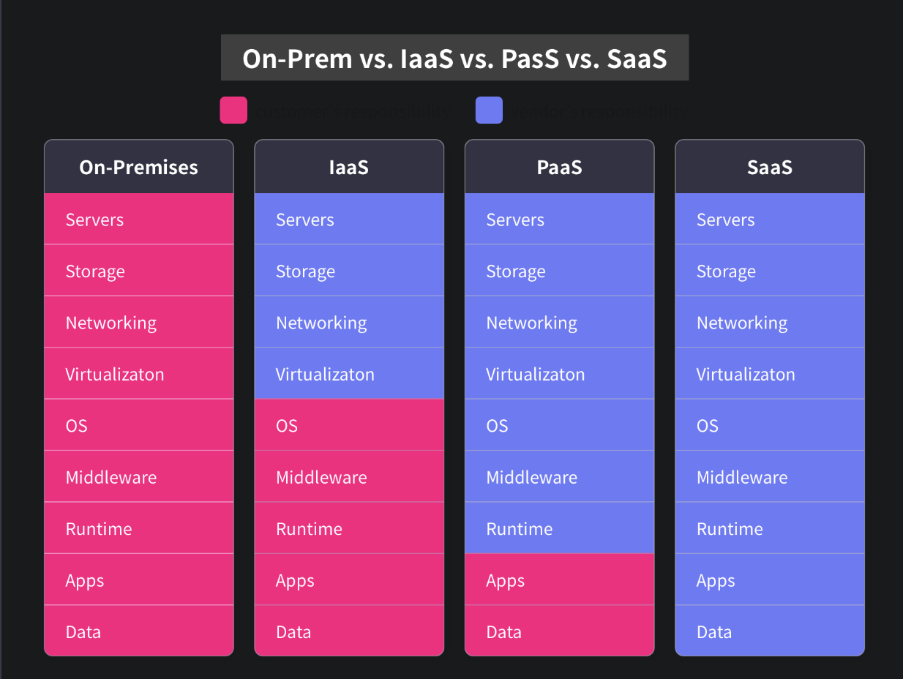

## Cloud Service
컴퓨팅 자원을 추상화하여 사용자가 필요로 할 때 인터넷을 통해 즉시 제공 (On-Demand) 하는 것
- 가용성 (Availability): 원하는 때에 장애 없이 서비스를 이용할 수 있는 속성
- 확장성 (Scalability): 시스템의 성능을 쉽게 조절할 수 있는 속성
- 탄력성 (Elasticity): 변화하는 부하에 빠르게 시스템 성능을 조절할 수 있는 속성

### 배포 형태
||장점|단점|
|--|--|--|
|Private Cloud(클라우드를 온프레미스로 구축)|데이터를 외부에 보관하는 데서 오는 불안을 해소할 수 있다.|온프레미스 구축 을 위한 비용이 추가된다.확장성과 탄력성이 줄어든다.|
|Public Cloud|높은 가용성, 확장성, 탄력성을 가진다.|클라우드 플랫폼에 의존하게 된다.|
|Hybrid Cloud|프라이빗 클라우드와 퍼블릭 클라우드의 장단점을 취합해서 사용할 수 있다.|프라이빗 클라우드를 구축하고 운영하는 비용, 퍼블릭 클라우드 이용 비용이 모두 발생한다.|

### Cloud 서비스 분류
- IaaS(Infrastructure as a Service)
  - 서버, 스토리지,네트워크와 같이 가장 기본적인 컴퓨팅 자원 제공
  - AWS EC2, GCP GCE, Azure의 VM 등
- PaaS(Platform as a Service)
  - 애플리케이션 구현에 도움이 되는 플랫폼 제공해주는 서비스
  - 플랫폼에는 데이터베이스,파일 시스템, 인공지능, 빅데이터 처리도구, 서버리스 개발 도구
  - AWS Elastic Beanwalk, Heroku 등
  - 플랫폼의 유지 보수 책임은 클라우드 제공자에게 있으므로 사용자가 져야 할 보안 책임이 IaaS보다 적음.
- SaaS(Software as a Service)
  - 소프트웨어를 제공
  - Google G Suite, Microsoft Office 365
  - 사용자가 제어할 수 있는 부분이 거의 없으므로 보안 관리 책임은 대부분 서비스 제공자에게 있음.
    

공유 책임 모델 (Shared Responsibility Model, SRM): 클라우드 사용자와 제공자가 나눠 갖는 보안 책임을 명시한 모델    
Role Based Access Control (RBAC): 사용자의 역할 기반으로 권한을 부여하는 것

### AWS Well-Architected
AWS에서 제공하는 클라우드 애플리케이션 평가 프레임워크.
- 신원 관리 및 접근 제어, 인프라보안, 데이터 보안, 탐지 등의 측면에서 평가
- [AWS Well-Archtected Tool](https://aws.amazon.com/ko/well-architected-tool/)

### AWS Config, AWS Artifact
AWS는 애플리케이션이 법 또는 계약상의 이유로 필요한 규정을 준수할 수 있도록 서비스를 제공한다.
- [AWS Config](https://aws.amazon.com/ko/config/), [AWS Artifact](https://aws.amazon.com/ko/artifact/)

