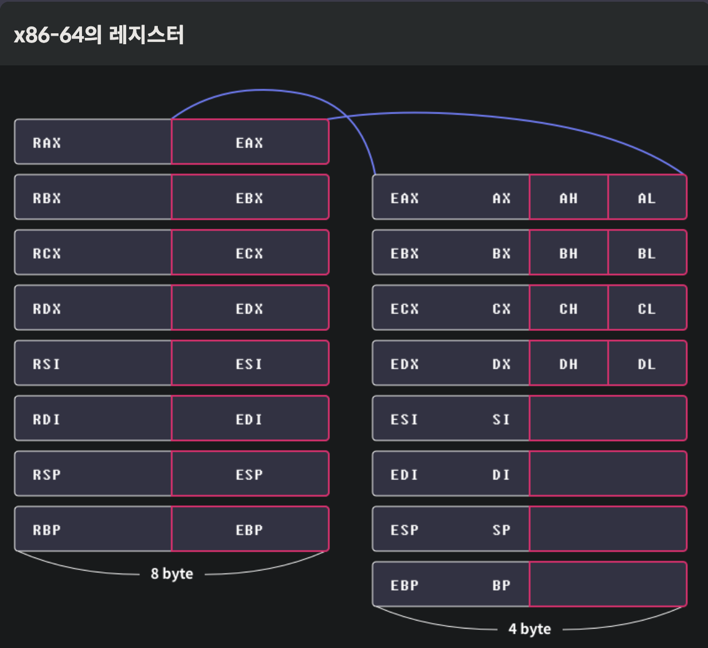

## 명령어 집합구조(Instruction Set Architecture, ISA)
컴퓨터 구조 중 CPU가 사용하는 명령어와 관련된 설계. x86-64는 가장 널리 사용되는 ISA 중 하나

## 컴퓨터 구조와 명령어 집합 구조
### 폰노이만 구조
폰 노이만은 컴퓨터에 연산,제어,저장의 세가지 핵심 기능이 필요하다고 생각.
- 중앙처리장치
    - 프로세스의 코드를 불러오고, 실행하고, 결과를 저장하는 일련의 모든 과정이 CPU에서 일어남
  - 산술/논리 연산을 처리하는 산술논리장치(Arithmetic Logic Unit, ALU)    
  CPU를 제어하는 제어장치(Control Unit)    
  CPU에 필요한 데이터를 저장하는 레지스터(Register)등으로 구성 됨
- 기억장치
  - 주기억장치 : 프로그램 실행과정에서 필요한 데이터 임시 저장하기 위해 사용. RAM(Random-Accesss Memory, RAM)
  - 보조기억장치 : 장기간 데이터 보관
- 버스
  - 데이터가 이동하는 데이터 버스
  - 주소를 지정하는 주소 버스
  - 읽기/쓰기를 제어하는 제어버스
  - 랜선,데이터 전송 SW, 프로토콜 등도 버스라고 불림

### 명령어 집합 구조(Instruction Set Architecture, ISA)
- x86-64는 고성능 프로세스 설계 위해 사용
- 스마트폰, 드론, 인공지능 스피커처럼 크기가 작은 임베디드 기기들은 전력소모와 발열이 적은 ARM이나 MIPS, AVR의 프로세서를 사용.

### N 비트 아키텍처
- '64비트 아키텍처'에서 64는 CPU가 한번에 처리할 수 있는 데이터의 크기를 의미
- WORD : CPU가 이해할 수 있는 데이터의 단위. 32비트 아키텍처는 ALU가 32비트까지 계산할 수 있으며 레스트 용량 및 각종 버스 대역폭이 32비트 임.

### x86-64 아키텍처: 레지스터
레지스터는 CPU가 데이터를 빠르게 저장하고 사용할 때 이용하는 보관소
- 범용 레지스터(General Register)
  - 다용한 용도로 사용될 수 있음. 8바이트를 저장. 부호 없는 정수를 기준으로 2^64-1까지의 수 표현 가능    
  
  |이름|주용도|
  |--|--|
  |rax(accumulator register)|함수의 반환 값|
  |rbx(base register)|x64에서는 주된 용도 없음|
  |rcx(counter register)|반복문의 반복 횟수, 각종 연산의 시행 횟수|
  |rdx(data register)|x64에서는 주된 용도 없음|
  |rsi(source index)|데이터를 옮길 대 원본을 가리키는 포인터|
  |rdi(destination index)|데이터를 옮길 때 목적지를 가리키는 포인터|
  |rsp(stack pointer)|사용 중인 스택의 위치를 가리키는 포인터|
  |rbp(stack base pointer)|스택의 바닥을 가리키는 포인터|

- 세그먼트 레지스터(Segment Register)
  - cs,ss,ds,es,fs,gs 총 6가지의 세그먼트 레지스터가 존재, 각 레지스터의 크기는 16비트
  - x64에서 cs,ds,ss 레지스터는 코드 영역과 데이터, 스택 메모리 영역을 가리킬 때 사용되고, 나머지 레지스터는 운영 체제 별로 용도를 결정할 수 있도록 범용적인 용도로 제작  
- 명령어 포인터 레지스터(Instruction Pointer Register)
  - CPU가 어느 부분의 코드를 실행할지 가리 킴
  - x64 아키텍처의 명령어 레지스터는 rip이며 크기는 8바이트
- 플래그 레지스터(Flag Register)
  - 프로세서의 현재 상태를 저장하고 있는 레지스터
  - x64아키텍처에서는 RFLAGS라고 불리는 64비트 크기의 프래그 레지스터가 존재
  - RFLAGS는 64비트이므로 최대 64개의 플래그 사용 가능하지만 실제로는 우측 20여개의 비트만 사용.    
  
    |플래그|의미|
    |--|--|
    |CF(Carry Flag)| 부호 없는 수의 연산 결과가 비트의 범위를 넘을 경우 설정 됨|
    |ZF(Zero Flag)|연산의 결과가 0일 경우 설정 됨|
    |SF(Sign Flag)|연산의 결과가 음수일 경우 설정 됨|
    OF(Overflow Flag)|부호 없는 수의 연산 결과가 비트 범위를 넘을 경우 설정 됨|

### 레지스터 호환
x86-64 아키텍처는 IA-32의 64비트 확장 아키텍처이며 호환이 가능하다.
- IA-32 레지스터 rax,rbx,rcs,rds,rsi,rdi,rsp,rbp는 x86-64에서 그대로 사용 가능
- x86-64 rax,rbx,rcx.. 등이 확장된 형태이며 eax,ebx등은 확장된 레지스터의 하위 32비트 가리킴
- 마찬가지로 16비트 아키텍처인 IA-16과의 호환 위해 ax,bx,..는 하위 16비트 가리킴 
