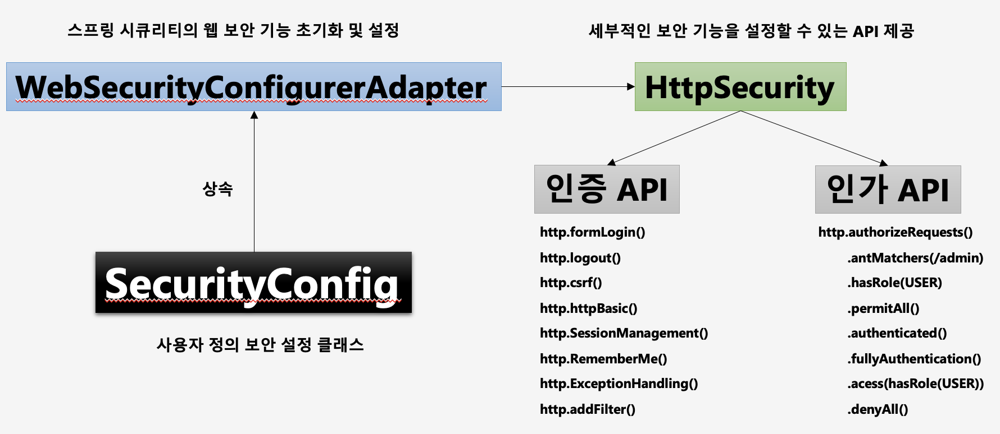
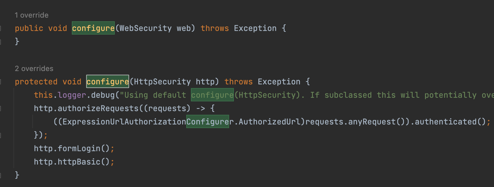
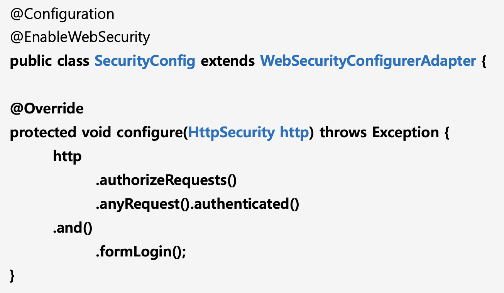

# 사용자 정의 보안 기능 구현


WebSecurityConfigurerAdapter의 configure로 인해 default로 보안 기능이 활성화 되어 있음.

configure()를 override해서 사용자 정의 보안 기능을 구현한다.

기본적인 configure() override


기본으로 제공되는 password가 매우 길다. 변경해 보자.
application.properties
```properties
spring.security.user.name=user
spring.security.user.password=1111
```


