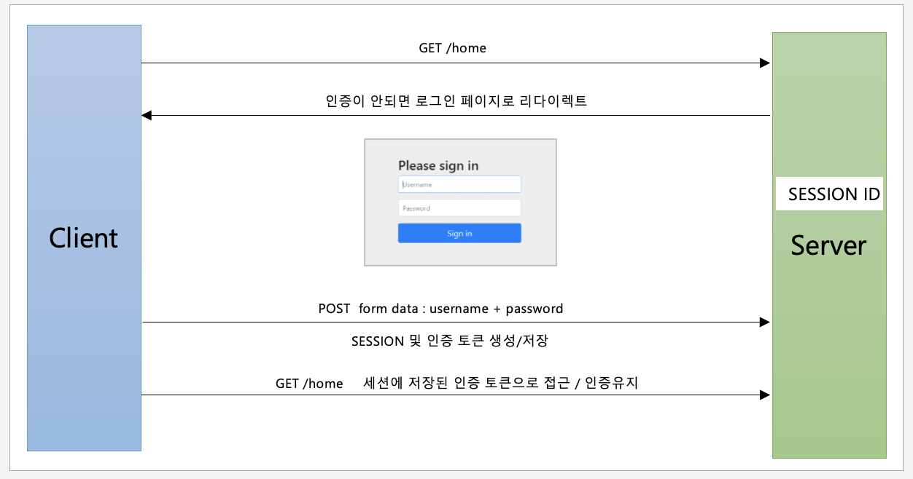

# Form Login 인증


## 인증 API - From Login 인증
```java
//SecurityConfig.java
@Override
protected void configure(HttpSecurity http) throws Exception {
    http
        .authorizeRequests() //인가 요청
        .anyRequest().authenticated();//모든 요청에 대해 인증 필요
    http        
        .formLogin() //폼 로그인 사용
        .loginPage("/login_page") //사용자 정의 로그이 페이지
        .loginProcessingUrl("/login_proc")      
        .defaultSuccessUrl("/") //로그인 성공 후 이동 페이지
        .usernameParameter("userId") //아이디 파라미터명 설정
        .passwordParamter("passwd") //패스워드 파라미터명 설정
        .failureUrl("/login?error=true") //로그인 실패 후 이동 페이지
        //AuthenticationSuccessHandler interface 구현체를 설정하면 됨
         .successHandler(new AuthenticationSuccessHandler() {
                    @Override
                    public void onAuthenticationSuccess(HttpServletRequest request, HttpServletResponse response, Authentication authentication) throws IOException, ServletException {
                        //Authentication 인증객체가 전달됨.
                        System.out.println("authentication"+authentication.getName());
                        response.sendRedirect("/"); //홈으로 리다이렉트                        
                    }
        })
        .failureHandler(customAuthenticationFailureHandler)
        .permitAll(); //login 페이지는 인증 받지 않아도 접근 가능하도록 함
}
```