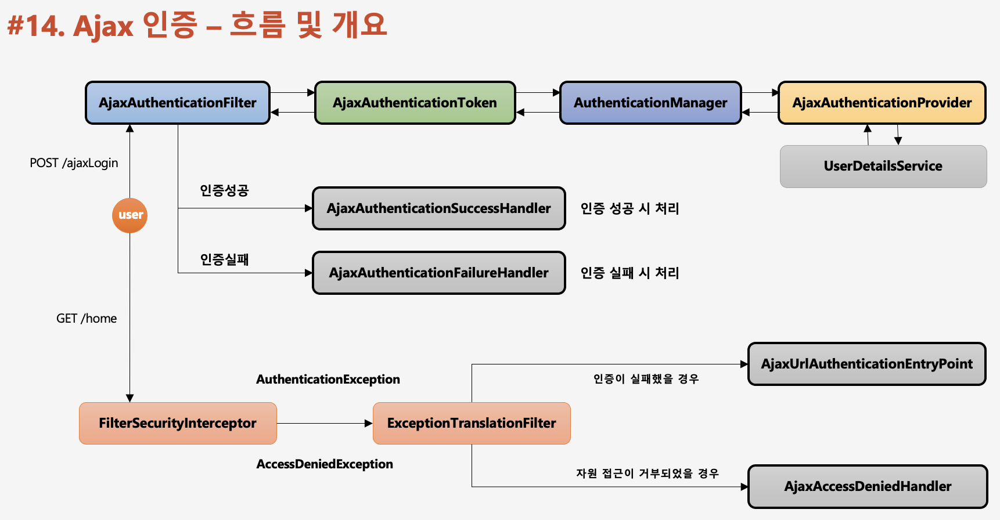

# Ajax Authentication 흐름

1. AjaxAuthenticationFilter에서 AjaxAuthenticationToken 인증객체에 사용자가 입력한 정보를 담는다.
2. Filter가 AuthenticationManager(인증관리자)에게 AjaxAuthenticationToken 객체를 전달한다.
3. AuthenticationManager는 실질적인 인증처리를 담당하는 AjaxAuthenticationProvider에게 처리를 위임한다.
4. 인증 성공 후에는 FilterSecurityInterceptor에서 인가처리를 담당한다.
5. AuthenticationException, AccessDeniedException이 발생하면
   ExceptionTranslationFilter에게 예외를 전달한다.
6. ExceptionTranslationFilter에서 처리 시  
   인증이 실패했을 경우 AjaxUrlAuthenticationEntryPoint에서 처리  
   자원접근이 거부되었을 경우 AjaxAccessDeniedHandler에서 처리
